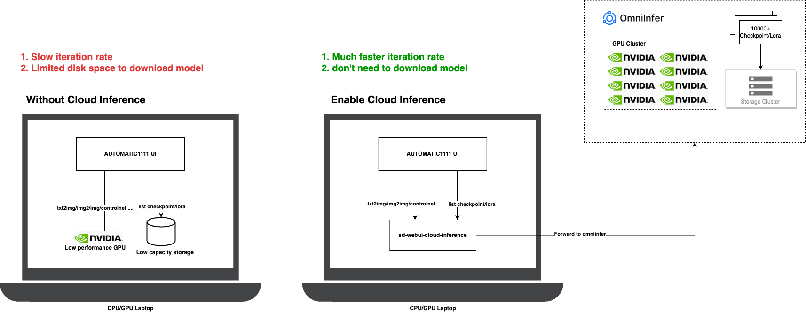

# Stable Diffusion Web UI Cloud Inference

## What capabilities does this extension offer?

This extension enables faster image generation without the need for expensive GPUs and seamlessly integrates with the AUTOMAIC1111 UI.

## Benefits:
1. **No expensive GPUs required**, can even use the CPU.
2. **No need to change your workflow**, compatible with the usage and scripts of sd-webui, such as X/Y/Z Plot, Prompt from file, etc.
3. **Support for 10000+ Checkpoint models**, don't need download

## Docs

* [Quick Start - Stable Diffusion WebUI Cloud Inference Tutorial](https://github.com/omniinfer/sd-webui-cloud-inference/wiki/Stable-Diffusion-WebUI-Cloud-Inference-Tutorial)

## How it works

## Compatibility and Limitations

| Feature                    | Compatibility | Limitations                                                                   |
| -------------------------- | ------------- | ----------------------------------------------------------------------------- |
| txt2img                    | ✅✅✅           | 🚫 Hires.fix, Tiling, restore face                                             |
| txt2img_controlnet         | ✅✅✅           | 🚫 Hires.fix, Tiling, restore face, Ending Control Step, Starting Control Step |
| img2img                    | ✅✅✅           | 🚫 Tiling, restore face                                                        |
| img2img_controlnet         | ✅✅✅           | 🚫 Hires.fix, Tiling, restore face, Ending Control Step, Starting Control Step |
| scripts - X/Y/Z plot       | ✅✅✅✅✅         | 🚫 Checkpoint name                                                             |
| scripts - Prompt matrix    | ✅✅✅✅✅         |                                                                               |
| scripts - Prompt from file | ✅✅✅✅✅         |                                                                               |
